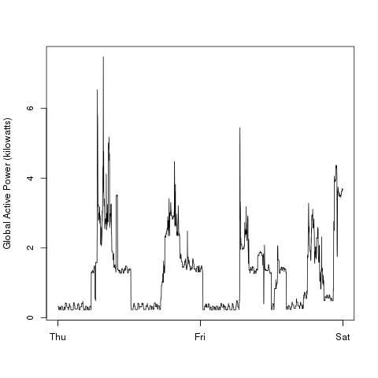
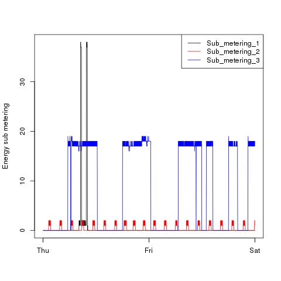

## Introduction

This assignment uses data from
the <a href="http://archive.ics.uci.edu/ml/">UC Irvine Machine
Learning Repository</a>, a popular repository for machine learning
datasets.

The datafile can be found 
<a href="https://d396qusza40orc.cloudfront.net/exdata%2Fdata%2Fhousehold_power_consumption.zip"> here (20MB)</a> 

The file contains measurements of electric power consumption in
one household with a one-minute sampling rate over a period of almost
4 years. Different electrical quantities and some sub-metering values
are available.

Dataset contains the followind columns:

   * **Date**:  Date in format dd/mm/yyyy
   * **Time**: time in format hh:mm:ss
   * **Global_active_power**: household global minute-averaged active power (in kilowatt)
   * **Global_reactive_power**: household global minute-averaged reactive power (in kilowatt)
   * **Voltage**: minute-averaged voltage (in volt)
   * **Global_intensity**: household global minute-averaged current intensity (in ampere)
   * **Sub_metering_1**: energy sub-metering No. 1 (in watt-hour of active energy). It corresponds to the kitchen, containing mainly a dishwasher, an oven and a microwave (hot plates are not electric but gas powered).
   * **Sub_metering_2**: energy sub-metering No. 2 (in watt-hour of active energy). It corresponds to the laundry room, containing a washing-machine, a tumble-drier, a refrigerator and a light. </li>
   * **Sub_metering_3**: energy sub-metering No. 3 (in watt-hour of active energy). It corresponds to an electric water-heater and an air-conditioner.

## Runnning the scripts

The directory contains four scripts, named _plot1.R_, _plot2.R_, _plot3.R_ and _plot4.R_.
Running each script produces the corresponding graph in the working directory.

Upon execution, each script looks for the input text file (uncompressed) in the current directory and, if not found, checks whether a compressed copy exists.

Otherwise it downloads the file from the source URL and uncompresses it.

Then it loads the entire datasets in memory, selects the rows corresponding to the interval specified (2007 Feb.1st and Feb.2nd) and then it creates the graph.

Here are the four plots, as generated from the R scripts.

### Plot 1
 

### Plot 2
 

### Plot 3
 

### Plot 4
 
